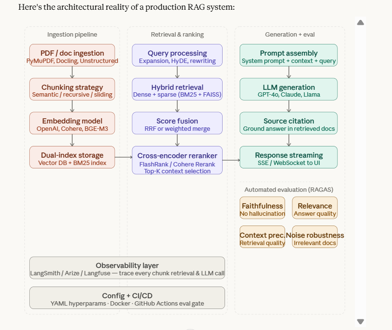

# 🚀 Production-Grade Advanced RAG Pipeline

> *"If you can't change your chunking strategy without touching your LLM call, your architecture has failed."*

A **production-grade, enterprise-ready Retrieval-Augmented Generation (RAG) system** built with LangChain, ChromaDB, Groq, Ollama, and Streamlit. This project is engineered following the same three-axis design philosophy used by senior ML engineers at scale: **data flow**, **control flow**, and **feedback flow**.

---

## 🧠 Problem Statement

Organizations possess vast amounts of unstructured data (research papers, PDF reports, contracts) but lack an efficient way to accurately query and verify that information at scale.

Naive RAG prototypes suffer from three critical failures:
1. **Hallucinations** — LLMs generate confident but fabricated answers when context is weak.
2. **Poor Retrieval** — Vector-only search misses exact keywords; BM25-only search misses semantic meaning. Neither alone is production-ready.
3. **Monolithic Architecture** — Single-script prototypes are impossible to debug, scale, evaluate, or hand off to a team.

**This project solves all three.**

---

## 🏗️ Architectural Reality of a Production RAG System



The pipeline is organized across three orthogonal axes:

| Axis | Responsibility |
|---|---|
| **Ingestion Pipeline** | PDF parsing → Chunking strategy → Embedding model → Dual-index storage (Vector DB + BM25) |
| **Retrieval & Ranking** | Query processing → Hybrid Retrieval → Score Fusion → Cross-encoder Reranking |
| **Generation + Eval** | Prompt assembly → LLM generation → Source citation → Automated RAGAS evaluation |

Plus two horizontal layers that run across everything:
- **Observability Layer** — LangSmith / Langfuse tracing every chunk retrieval, reranker score, and LLM prompt.
- **Config + CI/CD** — YAML hyperparameters, Docker, and GitHub Actions eval gate.

---

## ✅ Features Implemented

### Phase 1: Naive RAG Baseline
- **PDF Ingestion Engine**: Automatically parses and recursively chunks PDFs from the `data/` folder.
- **Local Embeddings**: Uses Ollama's `nomic-embed-text` to generate embeddings securely on-device.
- **Persistent Vector Store**: ChromaDB for local, persistent storage of document vectors.
- **Conversational Memory**: Full chat history using LangChain's `RunnableWithMessageHistory`.
- **Fast Inference**: Groq API (`llama-3.3-70b-versatile`) for near-instant language generation.

### Phase 2: Advanced Hybrid Retrieval & Reranking
- **Sparse Retrieval (BM25)**: `rank_bm25` for exact-match keyword search — critical for serial numbers, acronyms, and technical jargon.
- **Dense Retrieval (Vector Search)**: ChromaDB for deep semantic search.
- **Hybrid Fusion**: Merges both result sets using **Reciprocal Rank Fusion (RRF)** via LangChain's `EnsembleRetriever`.
- **Cross-Encoder Reranking**: `FlashrankRerank` scores the top fused candidates against the actual user query and prunes to the absolute best chunks. *Retrieval is cheap and broad; reranking is expensive and precise.*

### Phase 2.5: Modular Production Architecture (Refactor)
Refactored from a monolithic script into a fully decoupled, class-based pipeline following the **separation of concerns** principle:

```
production_grade_RAG/
├── app.py                      # Streamlit Web UI (end-user interface)
├── main.py                     # CLI Entrypoint (admin, automation, debugging)
├── architecture.md             # Visual workflow documentation
├── config/
│   ├── config.yaml             # Artifact paths, DB locations (non-sensitive)
│   └── params.yaml             # Tunable hyperparameters: chunk_size, top_k, LLM temp
├── src/
│   ├── components/             # Core logic workers (stateless, reusable)
│   │   ├── data_ingestion.py   # PDF loading and chunking
│   │   ├── vector_store.py     # ChromaDB + BM25 index creation
│   │   └── rag_engine.py       # Full hybrid retrieval + reranking + LLM chain
│   ├── pipeline/               # Orchestrators (sequence the components)
│   │   └── stage_01_data_ingestion.py
│   ├── config/
│   │   └── configuration.py    # ConfigurationManager — reads YAMLs, returns typed entities
│   ├── entity/
│   │   └── config_entity.py    # Dataclasses enforcing strict typed config contracts
│   ├── constants/
│   │   └── __init__.py         # Hardcoded paths and magic strings
│   ├── logger/
│   │   └── custom_logger.py    # Centralized logging to console + file
│   ├── exception/
│   │   └── custom_exception.py # Custom exceptions with file/line-number tracing
│   └── utils/
│       └── common.py           # Shared helpers: read_yaml, create_directories
├── artifacts/                  # Generated assets (vector DB, raw chunks)
├── data/                       # Drop your PDFs here
├── research/                   # Jupyter notebooks for experiments
├── tests/                      # Unit and integration tests
└── docs/                       # Documentation and diagrams
```

---

## 💻 Getting Started

### 1. Prerequisites
- Python 3.10+
- [Ollama](https://ollama.com/) running locally

Pull the required local models:
```bash
ollama pull nomic-embed-text
```

### 2. Environment Setup
Create a `.env` file in the root directory:
```env
OLLAMA_BASE_URL=http://localhost:11434
OLLAMA_EMBEDDING_MODEL=nomic-embed-text

GROQ_API_KEY=your_groq_api_key_here
GROQ_MODEL=llama-3.3-70b-versatile
```

### 3. Installation
```bash
conda create -n rag_env python=3.10 -y
conda activate rag_env
pip install -r requirements.txt
```

### 4. Usage

**Ingest documents (first time or when you add new PDFs):**
```bash
python main.py --ingest
```

**Chat via CLI (fast testing and debugging):**
```bash
python main.py --chat
```

**Launch the Streamlit Web UI:**
```bash
streamlit run app.py
```

---

## 🔬 Production Design Decisions

Based on industry patterns from senior ML engineers, the following decisions guide this architecture:

- **Chunk size/overlap are hyperparameters**, not constants. They live in `params.yaml` and vary by document type.
- **Retrieval is broad, reranking is precise.** We fetch top-50 candidates and cut to the best top-3 before sending to the LLM. Sending all results is expensive and harmful.
- **Every module fails loudly.** Custom exceptions capture the exact file and line number so debugging is never guesswork.
- **Configuration is decoupled from code.** Swapping ChromaDB for Pinecone or Groq for OpenAI requires editing a YAML — not the source code.

---

## 🗺️ Roadmap

- [ ] **Phase 3 — Automated Evaluation (RAGAS):** Generate a synthetic test suite and score the pipeline on Faithfulness, Answer Relevance, Context Precision, and Context Recall via `python main.py --evaluate`.
- [ ] **Observability:** Integrate Langfuse to trace every chunk retrieval, reranker score, and LLM prompt before adding more features.
- [ ] **CI/CD Eval Gate:** GitHub Actions step that runs the evaluation suite on every PR and fails if Faithfulness drops below a threshold — the single thing separating a research project from a production system.
- [ ] **Ingestion Hardening:** Document hash checks to prevent duplicate embeddings on re-ingestion.

---

## 🧰 Tech Stack

| Layer | Technology |
|---|---|
| LLM | Groq (`llama-3.3-70b-versatile`) |
| Embeddings | Ollama (`nomic-embed-text`) |
| Vector Store | ChromaDB |
| Sparse Retrieval | rank-bm25 |
| Reranker | FlashRank |
| Orchestration | LangChain LCEL |
| Web UI | Streamlit |
| Config Management | PyYAML + python-box |
| Evaluation | Ragas (coming soon) |
