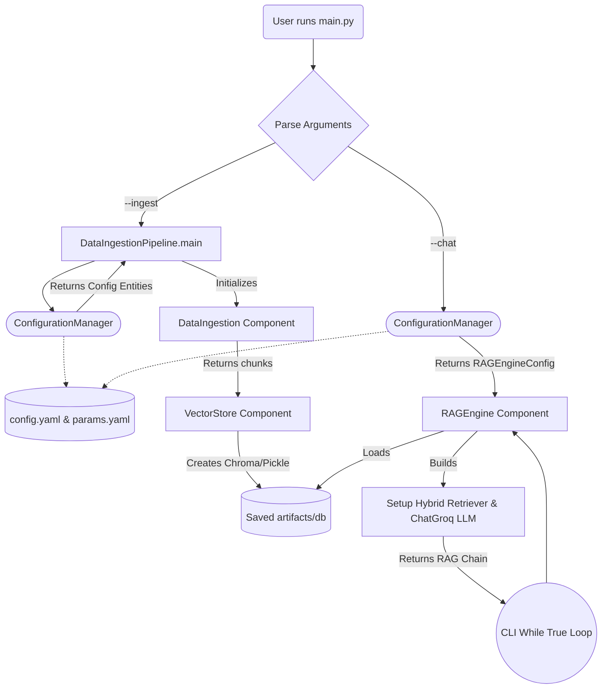
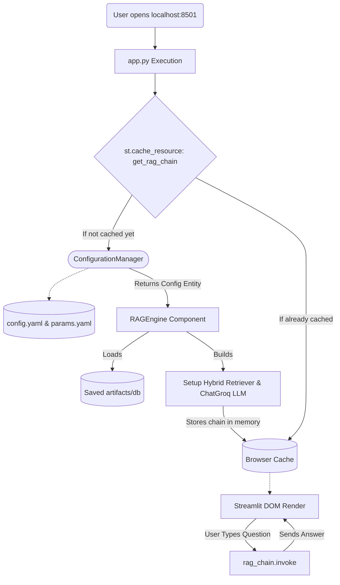

# Application Workflows

Here are the high-level flowcharts for how **`main.py`** (the CLI) and **`app.py`** (the Web UI) execute their respective logic. Both use the same foundational pieces, but follow slightly different orchestrations.

## 1. The `main.py` CLI Workflow

This is how the command line handles both running the ingestion and starting a chat terminal depending on the chosen flag.

## 2. The `app.py` Streamlit Workflow

This is how the web UI manages the inference (chat) side. Notice how it acts as the orchestrator and talks directly to the component, using `@st.cache_resource` so the database does not reload on every single interaction.

